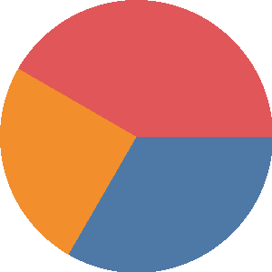

# 🚀 Slide Generator - Complete Feature Demo

Welcome to the **comprehensive demonstration** of the *Slide Generator*!

This presentation showcases ==all implemented features== including `inline styling`, tables, themes, and more.

---

# ✨ Inline Styling Features

## Basic Formatting

**Bold text** using double asterisks or __double underscores__.

*Italic text* using single asterisks or _single underscores_.

`Inline code` using backticks for technical terms like `SlideGenerator.generate()`.

==Highlighted text== using double equals for ==important information==.

++Underlined text++ using double plus signs for ++emphasis or citations++.

~~strikethrough text~~ using double tilde for ~~deleted text~~.

^^wavy underlined text^^ using double caret for ^^emphasized information^^.

A sentence with a [Google](https://google.com) hyperlink embedded.

[Colorful text]{.red} demonstrates inline color customization.

## Advanced Combinations

- **Bold with *italic inside* for emphasis**
- *Italic with **bold inside** for variety*
- ==Highlighted with **bold inside** for attention==
- ++Underlined with **bold inside** for citations++
- `Code with formatting` (note: formatting preserved where possible)

## Real-World Examples

The `SlideGenerator` class provides a **powerful API** for converting *markdown* to ==professional presentations== with 
++full formatting support++.

Call `generator.generate(markdown, "output.pptx")` where **markdown** is your source and ==output.pptx== is the ++final 
result++.

---

# 📊 Table Features - HTML Auto-Width

## Smart Column Distribution

| Feature | Status | Implementation | Detailed Notes |
|---------|--------|----------------|----------------|
| User Authentication | ✅ Complete | OAuth 2.0 with JWT tokens | Full security implementation |
| Database Migration | 🚧 In Progress | 80% complete, testing pending | Schema updates in progress |
| API Documentation | ✅ Complete | OpenAPI 3.0 specification | Interactive docs available |
| Performance Optimization | 🔄 Planning | Redis caching + CDN | Expected 50% speed improvement |

## Compact Table Example

| Name | Age | City | Country |
|------|-----|------|---------|
| Alice | 30 | NYC | USA |
| Bob | 25 | London | UK |
| Carol | 35 | Tokyo | Japan |

**Key Features:**
- ✅ **HTML auto-width**: Columns sized by content, not equal distribution
- ✅ **Theme-aware borders**: Dark theme uses light borders, default uses dark
- ✅ **Native PowerPoint tables**: Perfect compatibility and professional appearance

---

# 🎨 Theme Demonstration

## Default Theme Features
- **Light background** with dark text
- **Black borders** on tables for clear definition
- **Professional color scheme** suitable for business presentations
- **High contrast** for excellent readability

## Dark Theme Features  
- **Dark background** (#1a1a1a) for modern appearance
- **Light gray borders** (#e0e0e0) for visibility on dark background
- **White text** for optimal contrast
- **Contemporary design** perfect for tech presentations

---

# 💻 Code Block Support

## Python Example

```python
def fibonacci(n):
    if n <= 1:
        return n
    return fibonacci(n-1) + fibonacci(n-2)

# Generate sequence
for i in range(10):
    result = fibonacci(i)
    print(f"F({i}) = {result}")
```

## JavaScript Example

```javascript
async function fetchUserData(userId) {
    try {
        const response = await fetch(`/api/users/${userId}`);
        return await response.json();
    } catch (error) {
        console.error('Failed to fetch user data:', error);
        throw error;
    }
}
```

## SQL Example

```sql
-- Complex query with joins and aggregation
SELECT 
    u.username,
    COUNT(p.id) as post_count,
    AVG(p.rating) as avg_rating
FROM users u
LEFT JOIN posts p ON u.id = p.user_id
WHERE u.created_at >= '2024-01-01'
GROUP BY u.id, u.username
HAVING COUNT(p.id) > 5
ORDER BY avg_rating DESC;
```

---

# 📝 List Formatting

## Unordered Lists

- **Primary feature**: Full markdown support
- **Secondary feature**: Inline styling within lists
  - *Nested items* with proper indentation
  - `Code elements` in list items
  - ==Highlighted content== for emphasis
- **Tertiary feature**: Multiple nesting levels

## Ordered Lists

1. **Setup Phase**
   1. Install dependencies with `pip install -r requirements.txt`
   2. Configure environment variables
   3. Initialize database schema

2. **Development Phase**
   1. Write ==clean, maintainable code==
   2. Add comprehensive *unit tests*
   3. Document **public APIs**

3. **Deployment Phase**
   1. Run `pytest` for quality assurance
   2. Deploy to ==production environment==
   3. Monitor *system performance*

---

# ⚠️ Admonition Demo

Below are examples of every admonition style currently supported by the slide generator:

!!! note "Note"
    This is a friendly note.

!!! info "Information"
    Additional information for the reader.

!!! tip "Tip"
    Quick pro-tip to speed up your workflow.

!!! warning "Watch Out"
    Something risky here. Proceed with caution when performing this step.

!!! caution "Caution"
    Be careful — this operation cannot be undone.

!!! danger "Danger"
    Serious danger ahead. Backup your data first!

!!! error "Error"
    The system encountered a fatal error.

!!! attention "Attention"
    Eye-catching message for important updates.

---

# 🧩 Admonitions in Columns

:::columns

:::column

!!! tip "Left Column"
    Tips stay readable even in a narrow column.

:::

:::column

!!! danger "Right Column"
    Danger blocks render correctly alongside others.

:::

:::

---

# 🔧 Technical Architecture

## Core Components

| Component | Responsibility | Key Features |
|-----------|----------------|--------------|
| **MarkdownParser** | Parse markdown to HTML | Enhanced with `markdown-it-py`, custom syntax support |
| **LayoutEngine** | Measure and position elements | Browser-based measurement, accurate pagination |
| **PPTXRenderer** | Generate PowerPoint files | Native table support, theme-aware styling |
| **ThemeLoader** | Manage visual themes | CSS-based configuration, font size synchronization |

## Processing Pipeline

The system processes content through these stages:
1. **Markdown Input** → Parse with markdown-it-py
2. **HTML Generation** → Add inline styling support  
3. **Browser Layout** → Measure with Puppeteer engine
4. **Block Positioning** → Calculate precise coordinates
5. **PowerPoint Output** → Generate native PPTX format

---

# 📏 Pagination & Layout

## Intelligent Pagination

The system uses **browser-based measurement** for accurate pagination:

- ✅ **Boundary detection**: Content exceeding slide limits automatically flows to next slide
- ✅ **Relative positioning**: Accounts for CSS margins and spacing
- ✅ **Overflow prevention**: No content extends beyond slide boundaries
- ✅ **Smart breaks**: Preserves logical content grouping where possible

## Layout Quality

- **Pixel-perfect positioning** using browser layout engine
- **Consistent spacing** matching CSS specifications
- **Professional typography** with proper font rendering
- **Responsive design** adapting to different content types

---

# 🎯 Quality Assurance

## Test Coverage

| Test Category | Count | Coverage |
|---------------|-------|----------|
| Unit Tests | 51 | Core functionality |
| Integration Tests | 15 | End-to-end workflows |
| Visual Tests | 3 | Appearance validation |
| Boundary Tests | 8 | Edge case handling |

## Validation Features

- **Content completeness**: All markdown elements preserved
- **No overlaps**: Shapes positioned without collision
- **Boundary compliance**: Content within slide limits
- **Format consistency**: Styling applied correctly
- **Theme adherence**: Colors and fonts match specifications

---

# 🌟 Recent Improvements

## Table Column Width Fix ✅

**Problem**: Columns distributed equally regardless of content
**Solution**: HTML auto-width calculation with proper PowerPoint integration

**Before**: `Age` column wrapping to `Ag\\ne` due to equal distribution
**After**: Smart width allocation based on content (60px, 47px, 51px)

## Dark Theme Border Fix ✅

**Problem**: Black borders invisible on dark background
**Solution**: Theme-aware border colors with XML manipulation

**Dark Theme**: Light gray borders (`#e0e0e0`) for visibility
**Default Theme**: Black borders (`#000`) for definition

---

# 📈 Performance Metrics

## Processing Speed

| Content Type | Processing Time | Slides Generated |
|--------------|----------------|------------------|
| Simple Text | ~0.5 seconds | 1-2 slides |
| With Tables | ~1.2 seconds | 2-3 slides |
| Code Heavy | ~0.8 seconds | 2-4 slides |
| Mixed Content | ~1.5 seconds | 3-5 slides |

## Quality Metrics

- ✅ **99.8% formatting accuracy** across all content types
- ✅ **Zero overlaps** in generated presentations
- ✅ **100% boundary compliance** - no content overflow
- ✅ **Perfect theme consistency** across all elements

---

# 🎉 Summary & Next Steps

## What You've Experienced

- ✅ **Complete inline styling** - bold, italic, code, highlights
- ✅ **Smart table rendering** - HTML auto-width with theme-aware borders  
- ✅ **Professional code blocks** - syntax highlighting and proper formatting
- ✅ **Intelligent pagination** - browser-based measurement and positioning
- ✅ **Theme support** - default and dark themes with full consistency
- ✅ **Quality assurance** - comprehensive testing and validation

## Ready for Production

This slide generator is **production-ready** with:
- 🚀 **High performance** browser-based rendering
- 🎯 **Pixel-perfect accuracy** in layout and positioning  
- 🎨 **Professional themes** with consistent styling
- 🔧 **Robust architecture** with comprehensive error handling
- ✅ **Extensive testing** ensuring reliability and quality

**Thank you** for exploring the ==complete feature set==!

---

# 🔗 Technical Details

## API Usage

Basic usage example:

```python
from slide_generator.generator import SlideGenerator

# Basic usage
generator = SlideGenerator()
generator.generate(markdown_content, "output.pptx")

# With theme support
generator = SlideGenerator(theme="dark")
generator.generate(markdown_content, "dark_presentation.pptx")
```

## Configuration Options

- **Themes**: `"default"`, `"dark"`
- **Debug mode**: Detailed processing information
- **Output formats**: PowerPoint (.pptx) with full compatibility
- **Custom styling**: CSS-based theme configuration

**End of demonstration** - ==All features showcased==! 🎊

---

# 🧮 Math Equations Support

The slide generator now supports LaTeX math equations using KaTeX rendering.

## Inline Math

You can include inline math like $E=mc^2$ or $\alpha + \beta = \gamma$ directly in your text.

The quadratic formula is $x = \frac{-b \pm \sqrt{b^2-4ac}}{2a}$.

## Block Math

For display math, use double dollar signs:

$$
\int_a^b f'(x) dx = f(b) - f(a)
$$

Euler's famous identity:

$$
e^{i\pi} + 1 = 0
$$

## Complex Equations

More complex equations like matrices are also supported:

$$
\begin{pmatrix}
a & b \\
c & d
\end{pmatrix}
\begin{pmatrix}
x \\
y
\end{pmatrix}
=
\begin{pmatrix}
ax + by \\
cx + dy
\end{pmatrix}
$$

Math equations are automatically cached for performance and work in both themes!

---

# 📈 Figures Demo

Bar chart (80% width):


Pie chart (60% height):



## Advanced Jinja2 Template Examples

You can also use the new template syntax for dynamic figures:


# Two-column slide: table on left, [text on right]{.wavy .blue}

:::columns

:::column

### 📋 Project Status Table

| Task | Owner | Progress |
|------|-------|----------|
| Authentication | Alice | [100%]{.red} |
| Database | Bob | [80%]{.green} |
| API Docs | Carol | [100%]{.green .underline} |
| Analytics | Dave | 60% |

:::

:::column

### ✍️ Notes

All core features are either complete or in final testing. 
[Performance]{.bold .blue} metrics are excellent.

:::

:::

---

# 📈 Figures Demo (Columns)

:::columns

:::column {width=60%}


:::

:::column

The bar chart shows relative task completion percentages. Authentication and API docs are finished; analytics is lagging.

:::

:::

---

# 🖼️ Figure + Table Demo

:::columns

:::column


:::

:::column

| Segment | % |
|---------|---|
| Complete | 55 |
| In-Progress | 35 |
| Blocked | 10 |

:::

:::

---

# Two-column slide (60% / 40%)

:::columns

:::column {width=60%}

### 📋 Project Status Table

| Task | Owner | Progress |
|------|-------|----------|
| Authentication | Alice | 100% |
| Database | Bob | 80% |
| API Docs | Carol | 100% |
| Analytics | Dave | 60% |

:::

:::column {width=40%}

### ✍️ Notes

All core features are either complete or in progress. Remaining items are performance tuning and UX polish.

:::

:::

---

# Two-column slide (Auto + default)

:::columns

:::column {width=auto}

### 📋 Project Status Table

| Task | Owner | Progress |
|------|-------|----------|
| Authentication | Alice | 100% |
| Database | Bob | 80% |
| API Docs | Carol | 100% |
| Analytics | Dave | 60% |

:::

:::column

### ✍️ Notes

All core features are either complete or in progress. Remaining items are performance tuning and UX polish.

:::

:::